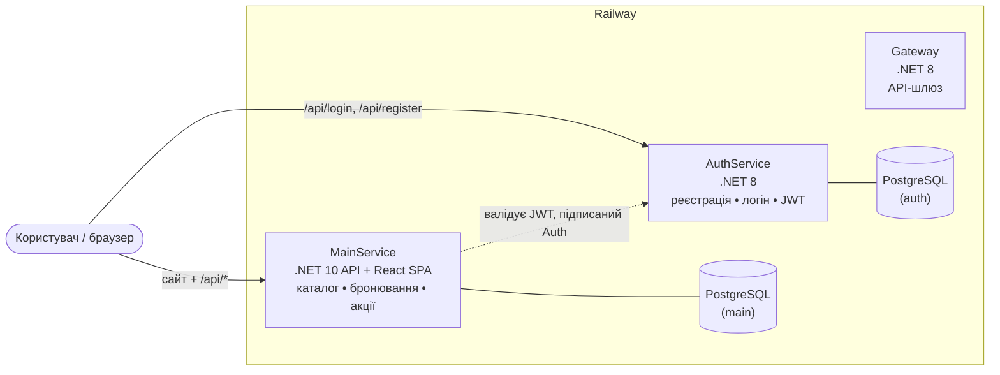

# PC Club — платформа бронювання компʼютерного клубу

Монорепозиторій сервісів для бронювання місць у компʼютерному клубі: каталог ПК,
онлайн-бронювання, акції, авторизація та особистий кабінет. Розгортається на **Railway**.

> Фронтенд (React) віддається безпосередньо MainService-ом, тому головний застосунок і сайт
> живуть на одному домені, а авторизацію видає окремий AuthService.

---

## 🧩 Архітектура



- **MainService** — Onion-архітектура (.NET 10), PostgreSQL, EF Core.
  Віддає REST API бронювання **і** статику React-фронта (SPA) з `wwwroot`.
  Лише **валідує** JWT (не видає).
- **AuthService** — сервіс авторизації (.NET 8): реєстрація/логін/refresh/logout,
  **видає** JWT, зберігає користувачів, сесії та ролі в PostgreSQL.
- **Gateway** — API-шлюз (.NET 8).
- Токен, підписаний AuthService, приймається MainService — тому обидва мусять мати
  **однаковий** `Jwt` (ключ, issuer, audience).

---

## 🛠 Стек

| Шар | Технології |
|-----|-----------|
| Backend | .NET 10 / .NET 8, ASP.NET Core, EF Core, Npgsql (PostgreSQL), FluentValidation, AutoMapper, Serilog, JWT (BCrypt) |
| Frontend | React 19, Vite 8, Tailwind CSS 4, React Router 7 |
| Інфраструктура | Docker (multi-stage), Railway, PostgreSQL |

---

## 📁 Структура репозиторію

```
.
├── MainService/                      # .NET 10 API + React-фронт (мій сервіс)
│   ├── Dockerfile                    # збирає React → wwwroot, потім .NET
│   ├── railway.json
│   ├── PCClubBooking.Api/            # контролери, Program.cs, wwwroot
│   ├── PCClubBooking.Application/    # сервіси, DTO, мапінги, валідатори
│   ├── PCClubBooking.Domain/         # сутності, enum-и
│   ├── PCClubBooking.Infrastructure/ # EF Core, репозиторії, міграції, сідер
│   ├── PCClubBooking.Tests/
│   └── clientapp/                    # React (Vite + Tailwind), "Hexagon"
├── AuthService/                      # .NET 8 сервіс авторизації
│   └── src/AuthService/{API,Application,Domain,Storage,Shared}
├── Gateway/                          # .NET 8 API-шлюз
├── docker-compose.yml                # локальний запуск усіх сервісів
└── RAILWAY_DEPLOY.md                 # детальна інструкція деплою на Railway
```

---

## ✨ Можливості

- Каталог компʼютерів за категоріями (**Standard / VIP / PS5**) з комплектацією та цінами
- Акції зі знижками
- Реєстрація та вхід (email/логін + пароль), JWT-авторизація
- Онлайн-бронювання реального ПК: вибір зони, тарифу (погодинний / ранковий / нічний), часу
- Особистий кабінет: історія бронювань, скасування активних
- Автоматичні міграції та наповнення БД демо-даними на старті

---

## 🔌 API

### MainService (`/api`)
| Метод | Шлях | Доступ | Опис |
|-------|------|--------|------|
| GET | `/api/computers` | публічно | список ПК |
| GET | `/api/computers/{id}` | публічно | один ПК |
| GET | `/api/computers/available?start=&end=` | публічно | вільні у проміжку |
| GET | `/api/computers/{id}/devices` | публічно | пристрої ПК |
| GET | `/api/promotions` | публічно | акції |
| POST | `/api/bookings` | user | створити бронювання |
| GET | `/api/bookings/my` | user | мої бронювання |
| POST | `/api/bookings/{id}/cancel` | user | скасувати |
| GET | `/api/bookings` | admin | усі бронювання (пагінація) |
| POST/PUT/DELETE | `/api/computers`, `/devices`, `/promotions` | admin | CRUD каталогу |

### AuthService (`/api`)
| Метод | Шлях | Опис |
|-------|------|------|
| POST | `/api/register` | реєстрація → `{ accessToken }` |
| POST | `/api/login` | вхід → `{ accessToken }` |
| POST | `/api/refresh` | оновлення токена (refresh-cookie) |
| DELETE | `/api/logout` | вихід |

**Правила реєстрації:** нікнейм 3–30 (літери/цифри/`_`, з літери); пароль 8–64,
велика + мала літера + цифра + спецсимвол.

---

## 💻 Локальний запуск

**Вимоги:** .NET SDK 10 та 8, Node.js 20+, PostgreSQL (або Docker).

### Через Docker Compose (усе разом)
```bash
docker compose up --build
```

### Вручну

**MainService (API + фронт):**
```bash
cd MainService
dotnet run --project PCClubBooking.Api
# API + сайт: http://localhost:8080  (Swagger: /swagger)
```

**Фронт у dev-режимі (hot reload):**
```bash
cd MainService/clientapp
npm install
npm run dev            # http://localhost:5173, проксі /api → :8080
```

**AuthService:**
```bash
cd AuthService/src/AuthService
dotnet run --project AuthService.API
```

---

## ⚙️ Змінні середовища

### MainService
| Змінна | Приклад |
|--------|---------|
| `ConnectionStrings__DefaultConnection` | `Host=...;Port=5432;Database=...;Username=...;Password=...` |
| `Jwt__Key` | спільний секрет (== `Jwt__SecretKey` в Auth) |
| `Jwt__Issuer` | `PCClubAPI` |
| `Jwt__Audience` | `PCClubAPIClient` |
| `ASPNETCORE_ENVIRONMENT` | `Development` — щоб бачити Swagger |

### AuthService
| Змінна | Приклад |
|--------|---------|
| `ConnectionStrings__DefaultConnection` | Npgsql-рядок до своєї БД |
| `Jwt__SecretKey` | **той самий** секрет, що `Jwt__Key` у MainService |
| `Jwt__Issuer` / `Jwt__Audience` | `PCClubAPI` / `PCClubAPIClient` |
| `Jwt__ExpirationMinutes` | `120` |
| `Session__Lifetime` / `Session__IdleTimeout` | `7.00:00:00` / `1:00:00` |

### Frontend (build-time, Vite)
| Змінна | Опис |
|--------|------|
| `VITE_AUTH_BASE` | URL AuthService + `/api`, напр. `https://auth-xxx.up.railway.app/api` |
| `VITE_API_BASE` | необовʼязково; за замовчуванням `/api` (той самий домен) |

> ⚠️ `Jwt` має **збігатися** між MainService і AuthService — інакше токен від Auth
> не пройде валідацію і захищені запити дадуть **401**.

---

## 🚀 Деплой (Railway)

Кожен сервіс = окремий Railway-сервіс із того самого репозиторію, зі своїм **Root Directory**:

| Сервіс | Root Directory |
|--------|----------------|
| MainService | `MainService` |
| AuthService | `AuthService/src/AuthService` |
| Gateway | `Gateway` |

Кожен білдиться своїм `Dockerfile`, слухає інжектнутий `PORT`, має власну PostgreSQL.
Покрокова інструкція — у [RAILWAY_DEPLOY.md](RAILWAY_DEPLOY.md).

---

## 🔐 Флоу авторизації

1. Фронт → `POST {AuthService}/api/register` або `/login` → отримує `accessToken`.
2. Токен зберігається в `localStorage`, стан — у `AuthContext`.
3. Запити до MainService йдуть з `Authorization: Bearer <token>`.
4. MainService валідує підпис/issuer/audience і дістає `userId` (Guid) та ролі з токена.
